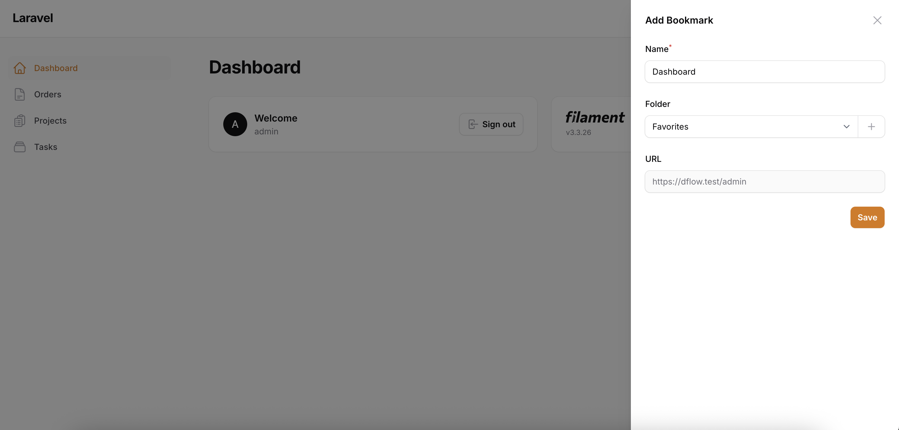
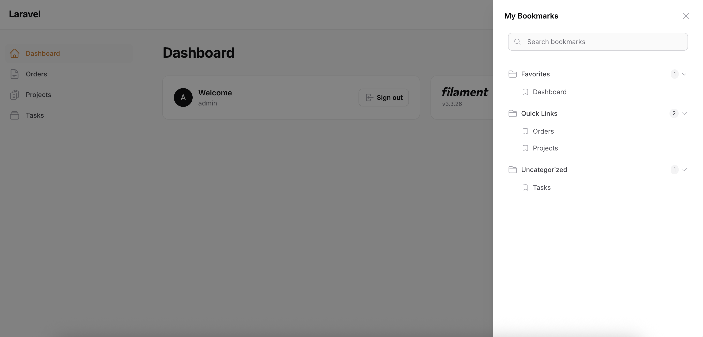

# Page Bookmarks

A simple bookmark management system for Laravel Filament applications. This package provides an intuitive way for users to save, organize, and access bookmarks directly within your Admin panel.

## Features

- 📚 **Smart Bookmark Creation**: Automatically captures the current page URL and title
- 📁 **Folder Organization**: Organize bookmarks into custom folders
- 🔍 **Real-time Search**: Search through your bookmarks with instant filtering
- ⌨️ **Keyboard Shortcuts**: Quick bookmark creation shortcut `Cmd+Shift+B` on Mac or `Ctrl+Shift+B` on Windows/Linux
- 👤 **User-specific**: Each user has their own private bookmarks
- 🎯 **Customizable**: Configurable icons, render hooks, table names

## Screenshots

### Add Bookmark


### View Bookmarks


## Requirements

- PHP 8.3+
- Laravel 10+
- Filament 3.2+
- Livewire 3+

## Installation

1. **Install the package via Composer:**

```bash
composer require jaysontemporas/page-bookmarks
```

2. **Publish and run the installation command:**

```bash
php artisan page-bookmarks:install
```

This command will:
- Publish the configuration file
- Publish and run the database migrations
- Publish the assets

## Configuration

### Basic Configuration

The package configuration file is located at `config/page-bookmarks.php`. Here are the main configuration options:

```php
return [
    // Table names (customizable to avoid conflicts)
    'tables' => [
        'bookmarks' => 'bookmarks',
        'bookmark_folders' => 'bookmark_folders',
    ],

    // User model for bookmark associations
    'models' => [
        'user' => \App\Models\User::class,
    ],

    // Icons used throughout the interface
    'icons' => [
        'add_bookmark' => 'heroicon-o-folder-plus',
        'view_bookmarks' => 'heroicon-o-bookmark',
        'bookmark_item' => 'heroicon-o-bookmark',
        'folder' => 'heroicon-o-folder',
        'search' => 'heroicon-o-magnifying-glass',
        'delete' => 'heroicon-o-trash',
        'chevron_down' => 'heroicon-o-chevron-down',
        'empty_state' => 'heroicon-o-bookmark',
    ],

    // Render hook positions in Filament
    'render_hooks' => [
        'add_bookmark' => \Filament\View\PanelsRenderHook::GLOBAL_SEARCH_AFTER,
        'view_bookmarks' => \Filament\View\PanelsRenderHook::GLOBAL_SEARCH_AFTER,
    ],
];
```

This package utilizes Filament's theming system, so you'll need to set up a custom theme to properly style all components.

> [!NOTE] Before proceeding, ensure you have configured a custom theme if you're using Filament Panels. Check the [Filament documentation on themes](https://filamentphp.com/docs/3.x/panels/themes) for detailed instructions. This step is required for both the Panels Package and standalone Forms package.

To properly compile all the package styles, update your Tailwind configuration by adding the package's view paths

### Customizing Render Hooks

You can customize where the bookmark components appear in your Filament panel by modifying the `render_hooks` configuration:

```php
'render_hooks' => [
    'add_bookmark' => \Filament\View\PanelsRenderHook::GLOBAL_SEARCH_AFTER,
    'view_bookmarks' => \Filament\View\PanelsRenderHook::GLOBAL_SEARCH_AFTER,
],
```

For a complete list of available render hook options, please refer to the [official Filament documentation](https://filamentphp.com/docs/3.x/support/render-hooks). The documentation includes all available `PanelsRenderHook` constants and their specific use cases.

## Usage

### Adding the HasBookmarks Trait

To enable bookmark functionality for your User model, add the `HasBookmarks` trait:

```php
<?php

namespace App\Models;

use Illuminate\Foundation\Auth\User as Authenticatable;
use JaysonTemporas\PageBookmarks\Traits\HasBookmarks;

class User extends Authenticatable
{
    use HasBookmarks;

    // ... rest of your User model
}
```

### Using Bookmarks in Your Application

Once the trait is added, you can use the bookmark functionality in your application:

```php
// Get user's bookmarks
$user = auth()->user();
$bookmarks = $user->bookmarks;

// Get bookmark folders
$folders = $user->bookmarkFolders;

// Create a new bookmark
$bookmark = $user->createBookmark([
    'name' => 'My Bookmark',
    'url' => 'https://example.com',
    'bookmark_folder_id' => $folder->id, // optional
]);

// Create a new folder
$folder = $user->createBookmarkFolder([
    'name' => 'Work Bookmarks',
]);

// Get bookmarks in a specific folder
$workBookmarks = $user->bookmarksInFolder($folder);

// Check if user has bookmarks
if ($user->hasBookmarks()) {
    // User has bookmarks
}

// Get bookmark counts
$bookmarkCount = $user->getBookmarksCount();
$folderCount = $user->getBookmarkFoldersCount();
```

### Available Methods

The `HasBookmarks` trait provides the following methods:

- `bookmarks()` - Get all bookmarks for the user
- `bookmarkFolders()` - Get all bookmark folders for the user
- `rootBookmarks()` - Get bookmarks not in any folder
- `createBookmarkFolder(array $attributes)` - Create a new bookmark folder
- `createBookmark(array $attributes)` - Create a new bookmark
- `bookmarksInFolder(BookmarkFolder $folder)` - Get bookmarks in a specific folder
- `bookmarksInFolderById(int $folderId)` - Get bookmarks in a folder by ID
- `hasBookmarks()` - Check if user has any bookmarks
- `hasBookmarkFolders()` - Check if user has any bookmark folders
- `getBookmarksCount()` - Get total bookmark count
- `getBookmarkFoldersCount()` - Get total folder count

## User Interface

### Adding Bookmarks

1. **Click the bookmark icon** in the Filament panel header
2. **Use keyboard shortcut** (default: `Cmd+Shift+B` on Mac or `Ctrl+Shift+B` on Windows/Linux) 
3. The current page URL and title will be automatically captured
4. Enter a custom name (optional - defaults to page title)
5. Select or create a folder (optional)
6. Click "Save"

### Viewing Bookmarks

1. **Click the bookmark viewer icon** in the Filament panel header
2. Browse your bookmarks organized by folders
3. Use the search bar to filter bookmarks
4. Click on any bookmark to navigate to the saved URL
5. Hover over bookmarks to reveal the delete button

### Managing Bookmarks

- **Search**: Type in the search bar to filter bookmarks by name
- **Folders**: Click on folder headers to expand/collapse
- **Delete**: Hover over a bookmark and click the trash icon to delete
- **Navigation**: Click on any bookmark to navigate to the saved URL

## Database Schema

The package creates two tables:

### `bookmarks` table
- `id` - Primary key
- `user_id` - Foreign key to users table
- `name` - Bookmark name/title
- `bookmark_folder_id` - Foreign key to bookmark_folders table (nullable)
- `url` - The saved URL
- `created_at` - Creation timestamp
- `updated_at` - Last update timestamp

### `bookmark_folders` table
- `id` - Primary key
- `user_id` - Foreign key to users table
- `name` - Folder name
- `created_at` - Creation timestamp
- `updated_at` - Last update timestamp

## Customization

### Custom Icons

You can customize the icons used throughout the interface by modifying the `icons` configuration:

```php
'icons' => [
    'add_bookmark' => 'heroicon-o-bookmark-square',
    'view_bookmarks' => 'heroicon-o-bookmark',
    // ... other icons
],
```

### Custom Table Names

If you need to avoid table name conflicts, you can customize the table names:

```php
'tables' => [
    'bookmarks' => 'my_custom_bookmarks',
    'bookmark_folders' => 'my_custom_bookmark_folders',
],
```

### Custom User Model

If you have a custom User model, update the configuration:

```php
'models' => [
    'user' => \App\Models\CustomUser::class,
],
```

## Contributing

Contributions are welcome! Please feel free to submit a Pull Request.

## License

This package is open-sourced software licensed under the [MIT license](https://opensource.org/licenses/MIT).

## Support

If you encounter any issues or have questions, please open an issue on the GitHub repository.